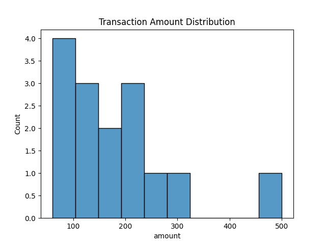
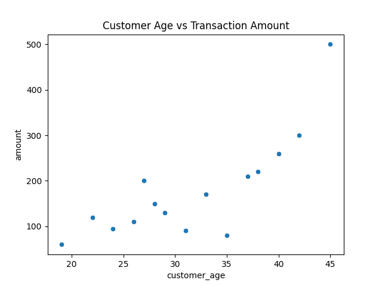
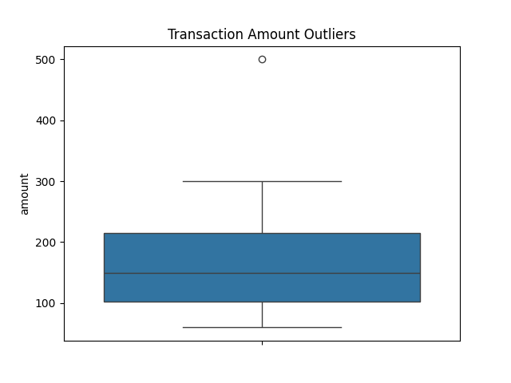

# 📊 SQL Statistical Analysis Project

Python | SQL | PostgreSQL | Data Analysis | Visualization

---

## 📌 Overview

This project demonstrates how **SQL and Python can be used together for statistical analysis of transactional data**.

The workflow includes:

1. Storing data in **PostgreSQL**
2. Performing **statistical analysis using SQL**
3. Exporting results
4. Creating **data visualizations using Python**

The goal of this project is to showcase **common data analysis techniques used by data analysts and data scientists**.

---

## 🗂 Project Structure

```
sql-statistical-analysis-project
│
├── dataset
│   └── transactions.csv
│
├── sql
│   ├── 01_descriptive_stats.sql
│   ├── 02_percentiles.sql
│   ├── 03_outlier_detection.sql
│   ├── 04_correlation.sql
│   ├── 05_frequency_distribution.sql
│   └── 06_zscore_analysis.sql
│
├── results
│   ├── descriptive_stats.csv
│   ├── percentiles.csv
│   ├── frequency_distribution.csv
│   ├── correlation.csv
│   ├── outliers.csv
│   ├── zscore_analysis.csv
│   └── charts
│       ├── amount_distribution.png
│       ├── age_vs_amount.png
│       └── outliers.png
│
├── analysis
│   └── analysis.py
│
├── requirements.txt
└── README.md
```

---

## 📂 Dataset

The dataset contains **synthetic customer transaction data** used to demonstrate statistical analysis.

| Column            | Description                                  |
| ----------------- | -------------------------------------------- |
| transaction_id    | Unique transaction identifier                |
| customer_age      | Age of the customer                          |
| amount            | Transaction amount                           |
| days_since_signup | Number of days since the customer registered |

---

## 📈 Statistical Analysis Performed

### 1️⃣ Descriptive Statistics

Calculates measures of central tendency and spread.

Metrics calculated:

* Mean
* Median
* Standard Deviation
* Variance
* Minimum
* Maximum

---

### 2️⃣ Percentile Analysis

Percentiles help understand how data is distributed.

Calculated percentiles:

* 25th percentile (Q1)
* 50th percentile (Median)
* 75th percentile (Q3)
* 90th percentile

---

### 3️⃣ Outlier Detection

Outliers are detected using the **Interquartile Range (IQR) method**.

```
Lower Bound = Q1 − 1.5 × IQR
Upper Bound = Q3 + 1.5 × IQR
```

Transactions outside this range are flagged as potential anomalies.

---

### 4️⃣ Correlation Analysis

Correlation helps measure relationships between variables.

Relationships analyzed:

* Transaction amount vs customer age
* Transaction amount vs days since signup

---

### 5️⃣ Frequency Distribution

Transaction amounts are grouped into ranges to analyze spending patterns.

Example ranges:

```
0–100
100–200
200–300
300–400
400+
```

---

### 6️⃣ Z-Score Analysis

Z-score shows how far a transaction amount is from the mean.

Formula:

```
Z = (X − μ) / σ
```

Higher absolute Z-scores indicate unusual transactions.

---

## 📊 Data Visualizations

Python was used to generate charts for better understanding of the dataset.

Libraries used:

* pandas
* matplotlib
* seaborn

### Transaction Amount Distribution



### Customer Age vs Transaction Amount



### Outlier Detection



---

## 🛠 Technologies Used

* SQL
* PostgreSQL
* Python
* Pandas
* Matplotlib
* Seaborn
* Git
* GitHub

---

## ▶️ How to Run the Project

### 1. Clone the repository

```
git clone https://github.com/Daredevil-suburbs/sql-statistical-analysis-project.git
```

Move into the project directory:

```
cd sql-statistical-analysis-project
```

---

### 2. Install dependencies

```
pip install -r requirements.txt
```

---

### 3. Run the analysis

```
python analysis/analysis.py
```

Charts will automatically be generated in:

```
results/charts
```

---

## 🔎 Key Insights

* The dataset shows variation in transaction amounts across customers.
* Some transactions appear as **outliers**, indicating unusually high spending.
* Correlation analysis suggests limited relationship between age and transaction amount.
* Frequency distribution helps visualize customer spending behavior.

---

## 👨‍💻 Author

Daredevil Suburbs

---

## ⭐ If you found this project useful

Consider giving the repository a **star on GitHub**.
